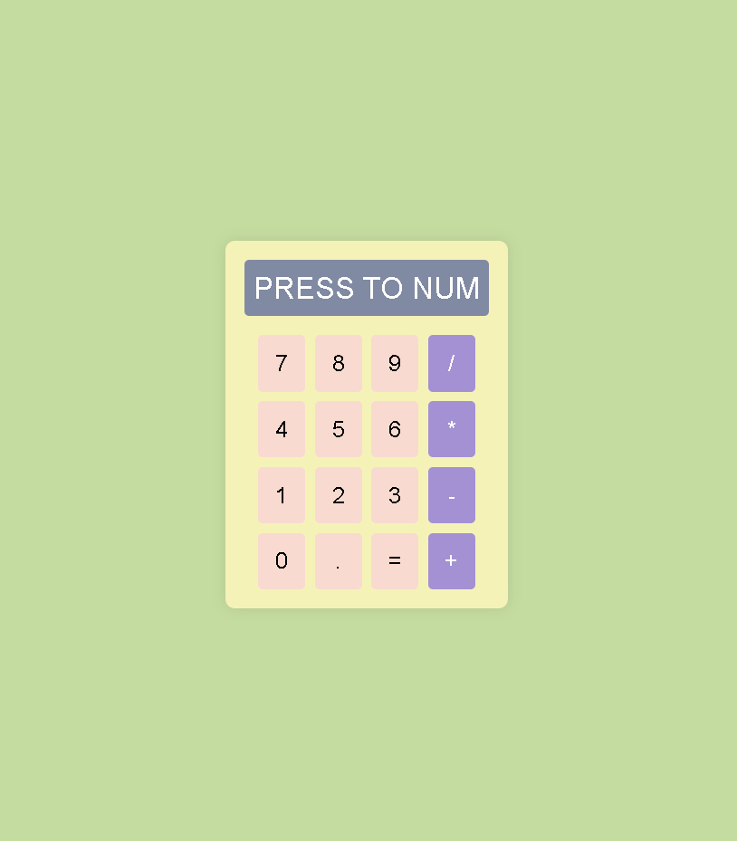

# Calculadora CSS

Este proyecto consiste en una calculadora básica creada únicamente con HTML y CSS, sin el uso de JavaScript.

## Captura de Pantalla

## Tecnologías Utilizadas

- **HTML5**: Para definir la estructura de la página.
- **CSS Grid**: Empleado para distribuir los botones en un formato de cuadrícula.
- **Flexbox**: Utilizado para centrar el contenedor de la calculadora en la página.
- **Diseño Responsivo**: Adaptable a diferentes tamaños de pantalla, incluidos dispositivos móviles.

## Explicación de Propiedades CSS

- **display: grid**: Se emplea para disponer los botones en una cuadrícula de 4 columnas.
- **grid-template-columns: repeat(4, 1fr)**: Define 4 columnas del mismo tamaño para los botones.
- **display: flex**: Usado para centrar el contenedor de la calculadora tanto horizontal como verticalmente.
- **justify-content** y **align-items**: Alinean los elementos dentro del contenedor flex.
- **box-shadow**: Añade una sombra alrededor del contenedor, creando un efecto de profundidad.
